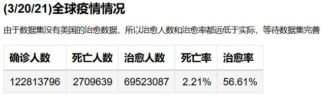
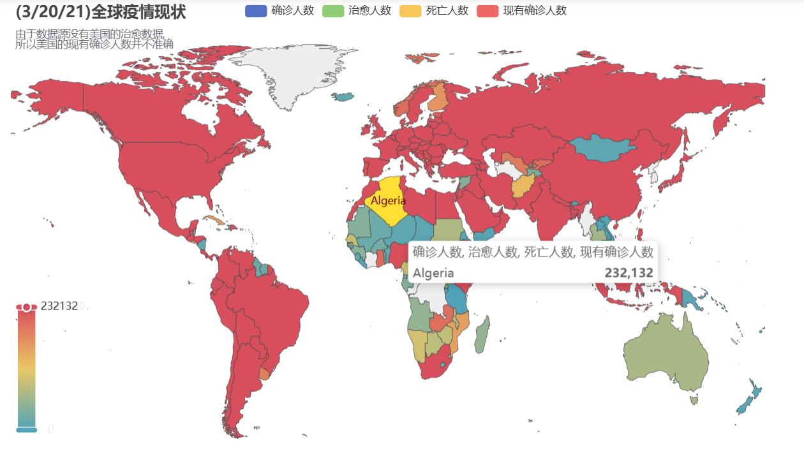
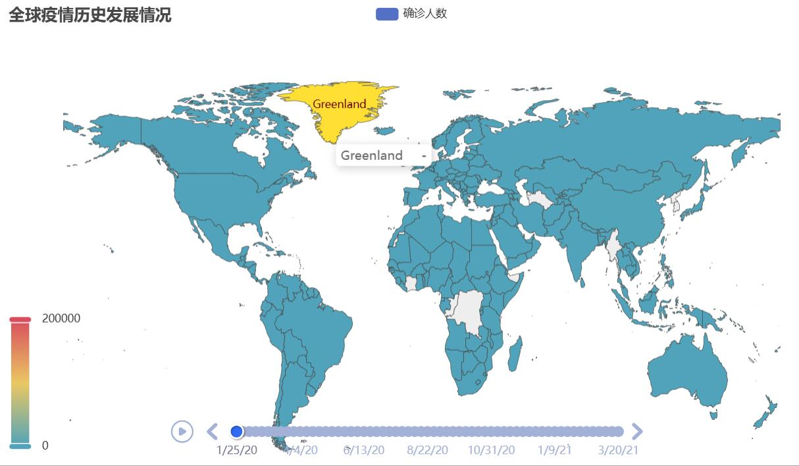
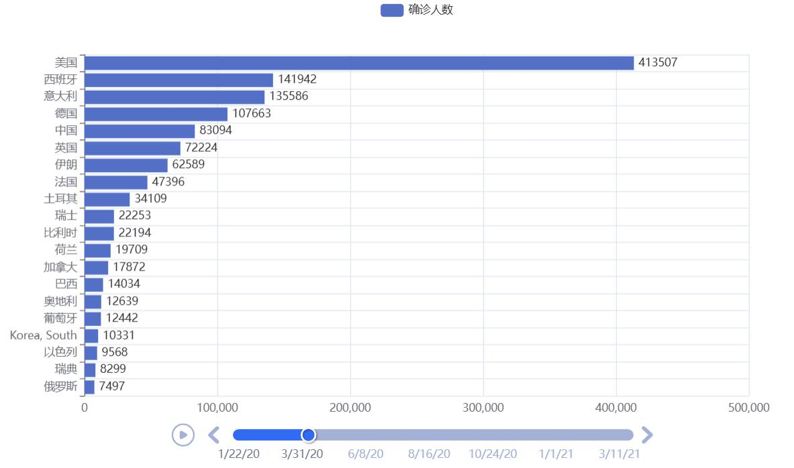
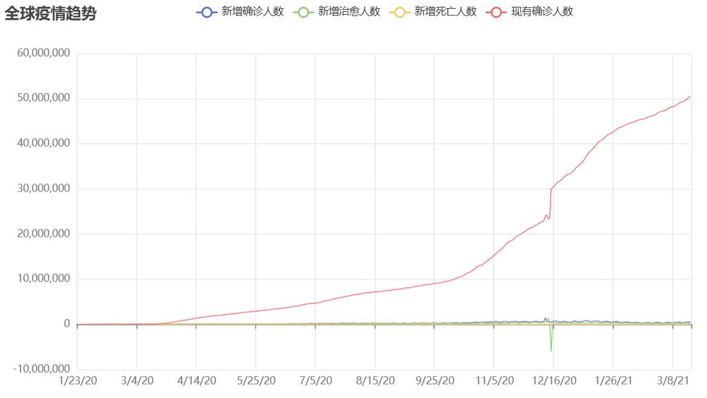
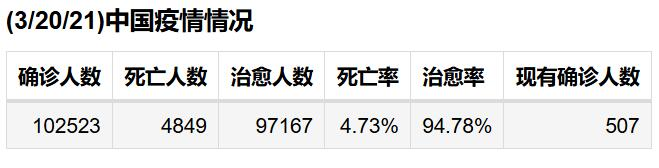
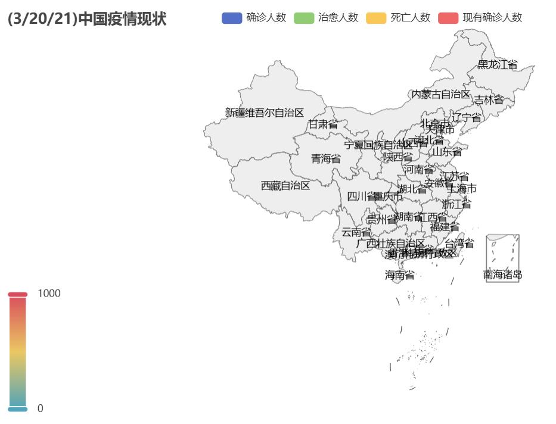
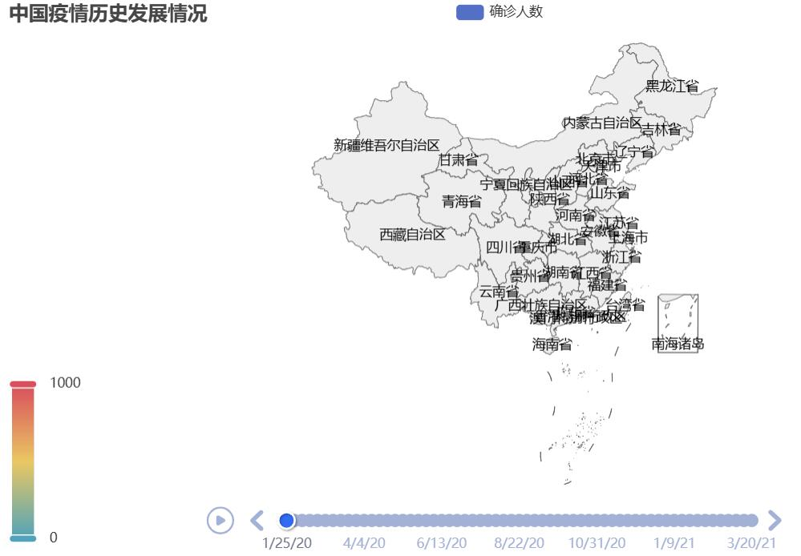
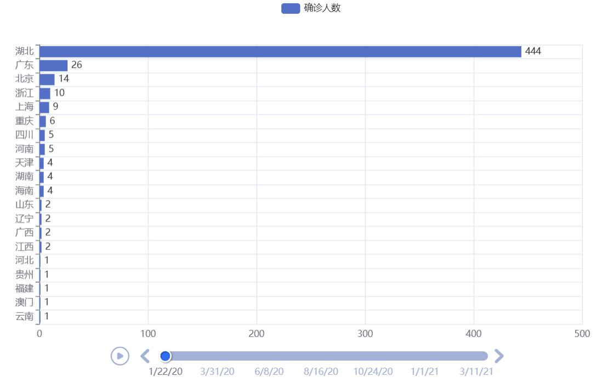
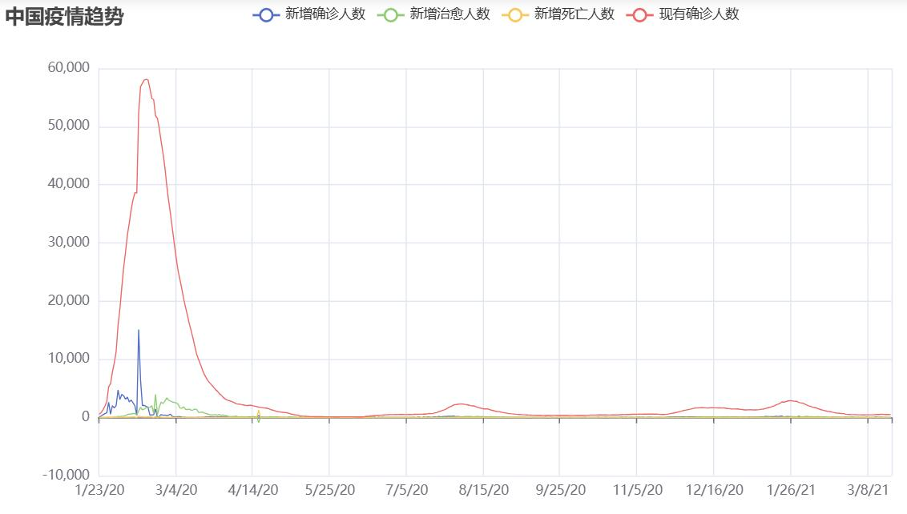

# COVID‑19全球疫情数据分析

## 一、项目简介

### 1.1 项目目标
读取全球新冠疫情时间序列数据集（确诊、死亡、康复三份csv），完成数据清洗、地域名称修正、中英文映射，统计全球及中国的确诊/死亡/治愈/现有确诊指标，输出：
1. 汇总统计表
2. 世界地图疫情分布图
3. 时间轮播地图（Timeline）展示疫情历史演变
4. 各国/各省确诊Top20横向柱状轮播图
5. 新增、现有确诊趋势折线图

### 1.2 技术栈
| 工具 | 用途 |
|---|---|
| pandas | csv读取、数据清洗、分组聚合统计 |
| pyecharts | Table、Map、Timeline、Bar、Line可视化 |
| Jupyter Notebook | 交互式渲染图表（`render_notebook()`） |

### 1.3 数据集说明
三份输入文件：
- `time_series_covid19_confirmed_global.csv`：全球各地区每日确诊
- `time_series_covid19_deaths_global.csv`：全球各地区每日死亡
- `time_series_covid19_recovered_global.csv`：全球各地区每日治愈

> 注意：数据集存在缺陷，美国无治愈数据，会造成全球、美国现有确诊、治愈率统计偏差，代码注释中已标注该问题。

## 二、数据预处理

### 2.1 地域数据修正
1. 将原始字段中 `US` 统一改写为 `United States`，统一国家名称；
2. 将 `Taiwan*` 归属至中国，`Province/State` 设置为 `Taiwan`，修正地域归属；
3. 构造国家、省份中英文映射字典 `country_map`、`province_map`，新增中文冗余列 `Country/Region_zh`、`Province/State_zh`；
4. 调整DataFrame列顺序，把中文省份、国家放到最前面。

核心预处理代码片段：
```python
import pandas as pd 

confirmed_data = pd.read_csv('time_series_covid19_confirmed_global.csv')
deaths_data = pd.read_csv('time_series_covid19_deaths_global.csv')
recovered_data = pd.read_csv('time_series_covid19_recovered_global.csv')

# 美国名称格式化
confirmed_data['Country/Region']=confirmed_data['Country/Region'].apply(lambda x: 'United States' if x == 'US' else x)
deaths_data['Country/Region']=deaths_data['Country/Region'].apply(lambda x: 'United States' if x == 'US' else x)
recovered_data['Country/Region']=recovered_data['Country/Region'].apply(lambda x: 'United States' if x == 'US' else x)

# 将台湾的数据归到中国
idx = confirmed_data[confirmed_data['Country/Region'] == 'Taiwan*'].index[0]
confirmed_data.loc[idx, 'Province/State'] = 'Taiwan'
confirmed_data.loc[idx, 'Country/Region'] = 'China'
idx = deaths_data[deaths_data['Country/Region'] == 'Taiwan*'].index[0]
deaths_data.loc[idx, 'Province/State'] = 'Taiwan'
deaths_data.loc[idx, 'Country/Region'] = 'China'
idx = recovered_data[recovered_data['Country/Region'] == 'Taiwan*'].index[0]
recovered_data.loc[idx, 'Province/State'] = 'Taiwan'
recovered_data.loc[idx, 'Country/Region'] = 'China'

# 省略 country_map、province_map字典，完整字典见源码
confirmed_data['Country/Region_zh'] = confirmed_data['Country/Region'].apply(lambda x: country_map.get(x, x))
confirmed_data['Province/State_zh'] = confirmed_data['Province/State'].apply(lambda x: province_map.get(x, x))

# 调整字段顺序
confirmed_data = confirmed_data[['Province/State_zh', 'Country/Region_zh'] + confirmed_data.columns[:-2].to_list()]
```

## 三、全球疫情统计与可视化

### 3.1 全球汇总统计表

取数据集最后一列（最新日期），统计全球总确诊、总死亡、总治愈，计算死亡率、治愈率，使用 pyecharts Table 组件输出汇总表格



### 3.2 全球疫情现状世界地图

Map 组件，同时展示确诊、治愈、死亡、现有确诊；现有确诊 = 总确诊 − 死亡 − 治愈。



### 3.3 Timeline 时间轮播：全球疫情历史演变

对时间列做步长为 7 采样（每周一个时间节点），循环生成每个时间节点的世界地图，放入 Timeline 实现轮播动画。



### 3.4 Timeline 轮播柱状图：各国确诊 TOP20

每个时间节点取确诊前 20 国家，横向反转柱状图，时间轴轮播排行变化。



### 3.5 全球疫情趋势折线图

遍历每一天，计算环比新增确诊、新增死亡、新增治愈、全球现有确诊，使用 Line 绘制多条趋势线。



## 四、中国疫情统计与可视化

### 4.1 筛选中国数据

通过`Country/Region == 'China'`筛选国内各省份数据，统计国内总确诊、死亡、治愈、现有确诊，输出统计表。



### 4.2 中国省份疫情地图

pyecharts china 地图，展示各省份确诊、治愈、死亡、现有确诊。



### 4.3 Timeline：中国疫情历史地图轮播

按周采样时间节点，生成国内疫情演变轮播地图。



### 4.4 Timeline 轮播柱状：各省确诊 TOP20 排行



### 4.5 中国疫情趋势折线图

统计国内每日新增确诊、新增死亡、新增治愈、现有确诊，绘制趋势线。




